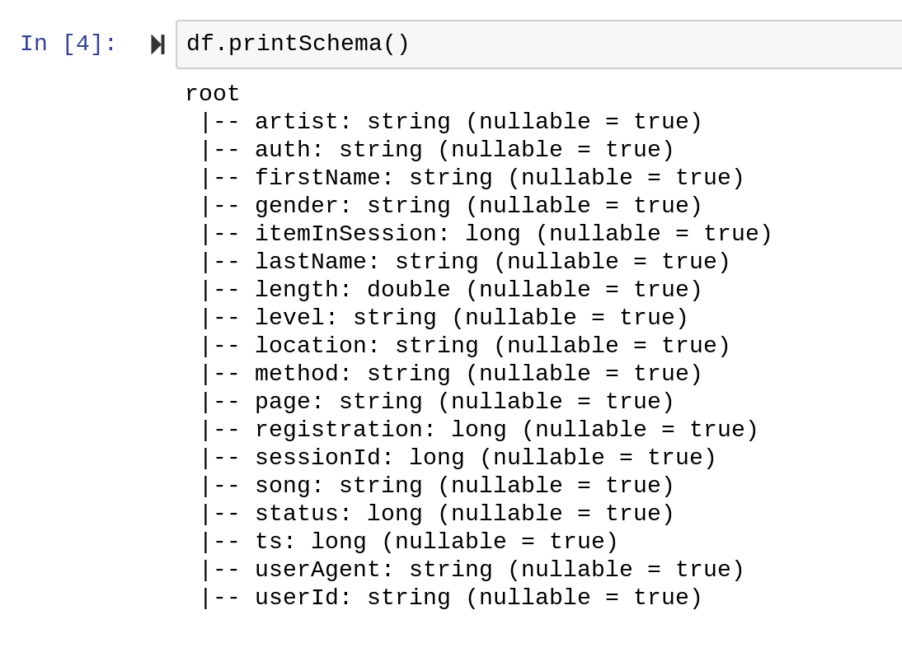

# Sparkify Churn Prediction
Repository for Churn Prediction notebook

# General Overview
This repository contains a notebook which provides a practical machine learning implementation to predict churn using a fictional digital music streaming service called Sparkify.

We are using Spark since the dataset is 12GB and we need the power of distributed machine learning technologies to help us with the heavy lifting.

# Problem statement
We have several of our customers leaving. Oh no! Let's try to find a way to predict them leaving before it happens. We will try to use machine learning classification algorithms and the data available to us to get to a solution.

# Data 
The 12GB dataset contains several potentially interesting fields derived from website interaction logs.

 

# Churn Defintion
In our case, Churn is defined as page == "Cancellation Confirmation".

# Metrics 
We use a variety of metrics to predict churn:
1. daily usage
2. 7d average usage
3. 30d average usage
4. averages compared to eachother 

# Instructions
You need to set up a SparkSession and have access to s3n://udacity-dsnd/sparkify/sparkify_event_data.json. See code below:

```python
# Starter code
from pyspark.sql import SparkSession

# Create spark session
spark = SparkSession \
    .builder \
    .appName("Sparkify") \
    .getOrCreate()

# Read in full sparkify dataset
event_data = "s3n://udacity-dsnd/sparkify/sparkify_event_data.json"
df = spark.read.json(event_data)
df.head()
```
